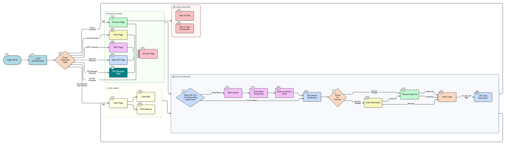

## Integrated Finance Management Portal for IIT Mandi

An **integrated, role-based finance management portal** for IIT Mandi built with **Next.js 15**, **React 19**, **Supabase**, and **NextAuth.js**.  
It streamlines workflows such as bill application and approval, auditing, student purchases, and finance administration in a single web interface.

---

## 🏗️ System Architecture



This architecture shows how the frontend, backend, authentication, and database layers interact to handle secure financial workflows and role-based operations.

---

## Features

- **Authentication & Security**
  - **NextAuth.js** authentication
  - **Supabase** as the primary data layer
  - **Role-based access control** (students, PDA managers, finance admins, auditors, etc.)

- **Finance & Bills**
  - **Apply Bill** flow with upload and history tracking
  - **Bill editor** and **bill details** view
  - **Bills dashboard** for quick overview and status
  - **Audit workflows** for reviewing and validating bills

- **Modules**
  - **Finance admin** panel
  - **PDA manager** interface
  - **Student purchase** management
  - **User management** pages

- **UX & UI**
  - Modern UI built with **Radix UI** primitives and utility components
  - **Responsive layout** optimized for desktop and mobile

---

## Tech Stack

- **Framework**: Next.js 15 (App Router)
- **Language**: TypeScript
- **UI / Styling**:
  - Tailwind CSS 4
  - Radix UI components
  - Custom reusable UI primitives
- **Auth & Data**:
  - Supabase
  - NextAuth.js
- **Email & Utilities**:
  - Nodemailer
  - LDAP integration

---

## Getting Started

### Prerequisites

- Node.js (LTS recommended)
- npm
- Supabase project

### Installation

```bash
git clone <your-repo-url>
cd integrated-finance-management-portal-for-iit-mandi
npm install
npm run dev
